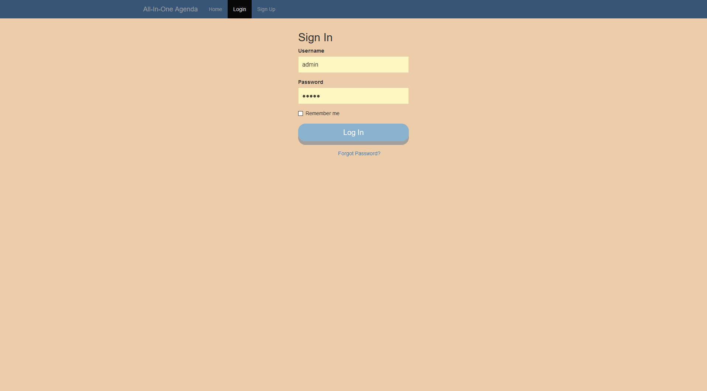
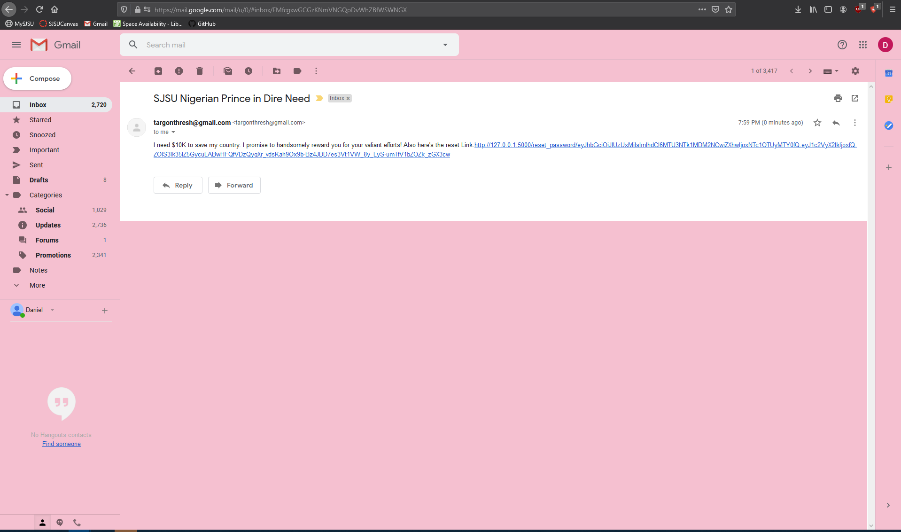
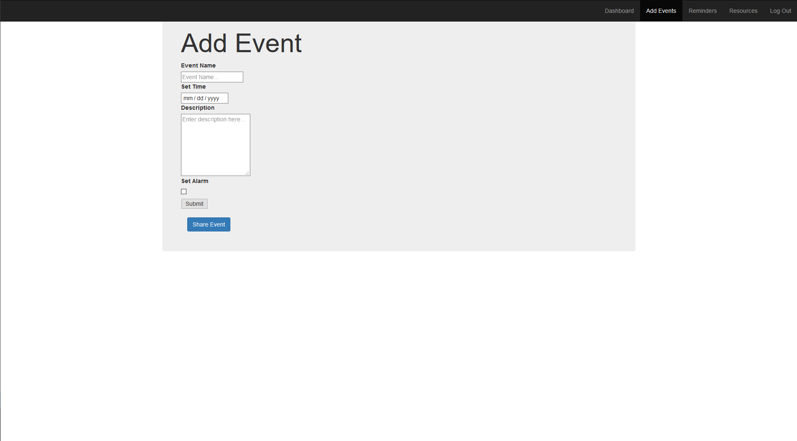

.. project documentation master file, created by
   sphinx-quickstart on Sun Dec  8 21:15:42 2019.
   You can adapt this file completely to your liking, but it should at least
   contain the root `toctree` directive.

Welcome to project's documentation!
===================================

.. toctree::
   :maxdepth: 2
   :caption: Contents:

   installation
   functions

Indices and tables
==================

* :ref:`genindex`
* :ref:`modindex`
* :ref:`search`

Screenshots
==============================================
Home Page
   Has a short summary of the purpose of the website.
.. image:: index.png

Log In Page
   Requires a username and password. Verifies it by checking the sqlite database called User.
   If it passes, user is redirected to the dashboard page.
   Includes a link if you forgot your password.

Sign Up Page
   Requests user for an email, username, and password. Stores it in database if email is not yet taken.
.. image:: sign_up.png

Reset Request Page
    A form that asks for a valid email.This page opens when you click the link
    "Forgot Password" located in the login page.
    If valid, sends the email via yagmail a token link. The token characters are randomly generated and expires in
   30 minutes due to the functions in models.py.
   If invalid, print invalid message and prevents code from sending a request token.
.. image:: reset_pw.png

This sends a token link to your email. The token expires in 30 minutes and is randomly
generated.

Reset Password Page
    A form that changes the password. Link can only be accessed by having a non-expired token link.
   User enters a new string (password) and submits. The new password then replaces
   the old password in the database.
.. image:: final_reset.png

Dashboard Page
   Shows additional features such as Google Calendar, Add Events, etc.
.. image:: dashboard.png

Reminders Page
   This is where the To Do List is located and the user can add/remove tasks.
.. image:: reminders.png

Resource Page
   Several useful links to increase productivity and a shortcut to popular sites.
.. image:: resources.png

Add Events Page
   Adds Events to the calendar. User inputs title, time, set alarm, and decide if they want
   to share the event with another user.

